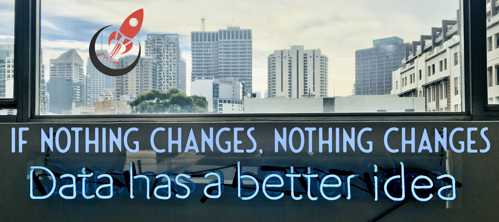

### Welcome here! 👋

#### I'm a Computer Scientist and Data Scientist with a wide variety of professional experiences.

I'm very passionate about AI, Data Science, Innovation, Tech, Sci-Fi and Videogames!

> When you do something, test a new approach or technology and make a contribution every day!!

- 📫 How to reach me: [my website with all informations](https://andreaguzzo.com)

<!--
**JeyDi/JeyDi** is a ✨ _special_ ✨ repository because its `README.md` (this file) appears on your GitHub profile.

Here are some ideas to get you started:

- 🔭 I’m currently working on ...
- 🌱 I’m currently learning ...
- 👯 I’m looking to collaborate on ...
- 🤔 I’m looking for help with ...
- 💬 Ask me about ...
- 📫 How to reach me: ...
- 😄 Pronouns: ...
- ⚡ Fun fact: ...

Usefull links: 
- https://github.com/matiassingers/awesome-readme
- https://guides.github.com/pdfs/markdown-cheatsheet-online.pdf
- https://dev.to/m0nica/how-to-create-a-github-profile-readme-1paj

-->
